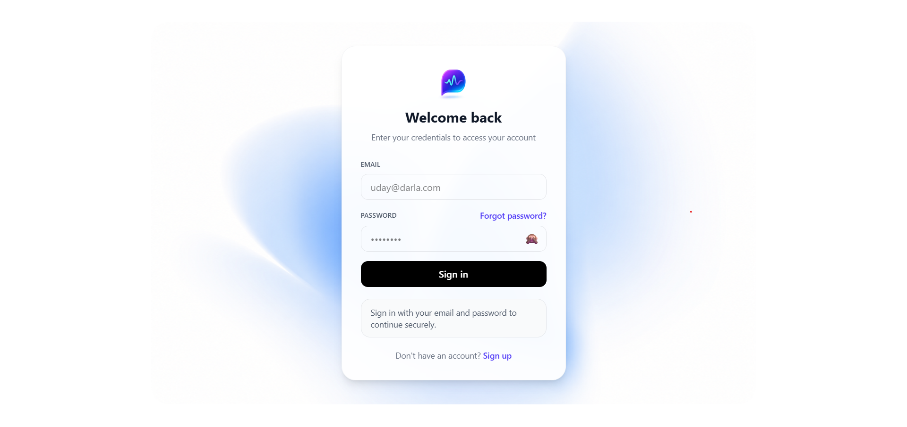
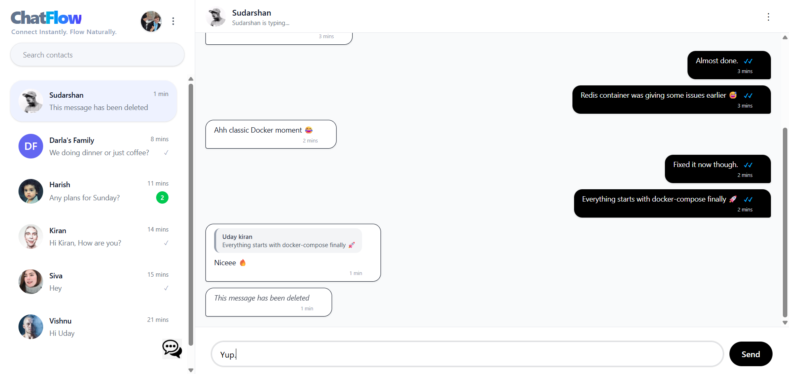
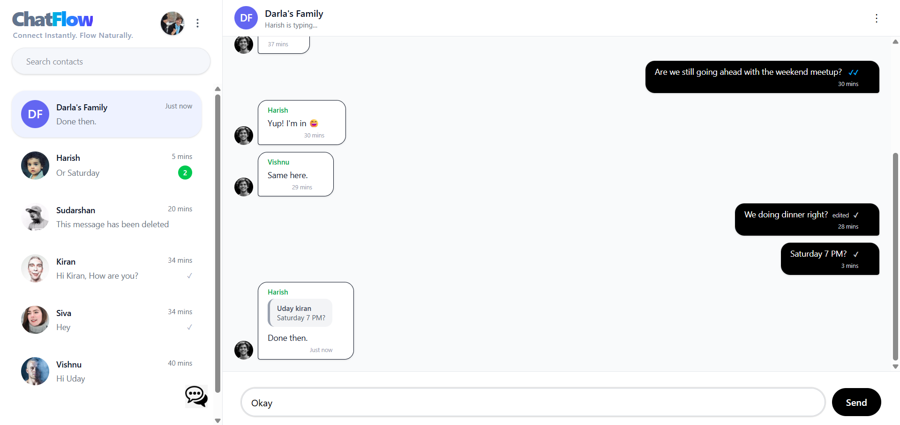

# ChatFlow 💬

### Real-Time Chat & Messaging Platform

> Connect Instantly. Flow Naturally.

ChatFlow is a production-grade real-time chat application built with **Node.js, Express, Socket.io, Redis, PostgreSQL, and React**.
It supports 1v1 messaging, group chats, typing indicators, seen receipts, online presence, and scalable real-time communication.

---

# ✨ Features

* 🔐 JWT Authentication
* 👤 User Profiles Management
* 💬 1v1 & Group Conversations
* ⚡ Real-Time Messaging using Socket.io
* ✅ Delivered & Seen Receipts
* 🟢 Online / Offline Presence
* ⌨️ Typing Indicators
* 🔍 Search Users & Messages
* ✏️ Edit / Delete Messages
* 📦 Dockerized Setup
* ☁️ AWS Ready Deployment
* 📄 Swagger API Documentation

---

# 🏗️ Tech Stack

## Backend

* Node.js
* Express.js
* Socket.io
* PostgreSQL
* Sequelize ORM
* Redis
* JWT Authentication
* Nodemailer
* Joi Validation

## Frontend

* React.js
* Redux Toolkit
* Tailwind CSS
* Axios
* Socket.io Client

## DevOps

* Docker
* Docker Compose

---

# 📁 Project Structure

```bash
chatflow/
│
├── chatflow-backend/
│   ├── src/
│   │   ├── config/
│   │   ├── constants/
│   │   ├── controllers/
│   │   ├── dto/
│   │   ├── middleware/
│   │   ├── models/
│   │   ├── routes/
│   │   ├── services/
│   │   ├── socket/
│   │   ├── utils/
│   │   ├── validators/
│   │   └── index.js
│   │
│   ├── package.json
│   ├── Dockerfile
│   └── .env.example
│
├── chatflow-frontend/
│   ├── src/
│   │   ├── api/
│   │   ├── components/
│   │   ├── hooks/
│   │   ├── pages/
│   │   ├── redux/
│   │   ├── router/
│   │   ├── socket/
│   │   ├── utils/
│   │   └── App.jsx
│   │
│   ├── package.json
│   └── Dockerfile
│   └── .env.example
│   └── index.html
│
├── docker-compose.yml
└── README.md
```

---

# 🚀 Getting Started

## 1️⃣ Clone Repository

```bash
git clone https://github.com/uday900/chatflow.git
cd chatflow
```

---

# ⚙️ Environment Variables

Both frontend and backend use environment variables.

## Backend Setup

```bash
cd chatflow-backend
cp .env.example .env
```

## Frontend Setup

```bash
cd chatflow-frontend
cp .env.example .env
```

Update the `.env` values according to your local setup.

---

---

# 🐳 Run with Docker

## Start Containers

```bash
docker-compose up --build
```

## Services

| Service     | Port |
| ----------- | ---- |
| Frontend    | 5173 |
| Backend API | 3000 |
| PostgreSQL  | 5432 |
| Redis       | 6379 |

---

# 💻 Local Development

## Backend

```bash
cd chatapp-backend

npm install
npm run dev
```

## Frontend

```bash
cd chatapp-frontend

npm install
npm run dev
```

---
# 🌐 REST API Endpoints

All APIs are versioned under:

```txt
/api/v1
```

---

## 🔐 Authentication (5)

| Method | Endpoint | Description |
|---|---|---|
| `POST` | `/api/v1/auth/register` | Register a new user |
| `POST` | `/api/v1/auth/login` | Authenticate user and generate JWT tokens |
| `POST` | `/api/v1/auth/forgot-password` | Send OTP for password reset |
| `POST` | `/api/v1/auth/verify-forgot-otp` | Verify forgot password OTP |
| `POST` | `/api/v1/auth/reset-password` | Reset user password using verified OTP |

---

## 👤 Users (7)

| Method | Endpoint | Description |
|---|---|---|
| `GET` | `/api/v1/users` | Get all users list |
| `GET` | `/api/v1/users/:id` | Get user details |
| `GET` | `/api/v1/users/contacts` | Get user contacts |
| `PATCH` | `/api/v1/users` | Update user name & profile |
| `PATCH` | `/api/v1/users/email` | Update user email |
| `PATCH` | `/api/v1/users/mobile` | Update user mobile |
| `GET` | `/api/v1/users/mobile/:mobileNumber` | Get user details by mobile |

---

## 💬 Chats (12)

| Method | Endpoint | Description |
|---|---|---|
| `GET` | `/api/v1/chats/my-chats` | Get all chats |
| `POST` | `/api/v1/chats/create` | Create new chat |
| `GET` | `/api/v1/chats/:id/messages` | Get chat messages |
| `PUT` | `/api/v1/chats/:id/messages/read` | Mark chat messages as read |
| `DELETE` | `/api/v1/chats/:id/clear` | Clear chat messages |
| `GET` | `/api/v1/chats/:id/group-details` | Get group chat details |
| `PUT` | `/api/v1/chats/update-group-info` | Update group info |
| `POST` | `/api/v1/chats/:id/members` | Add a member to group |
| `DELETE` | `/api/v1/chats/:id/members/:userId` | Remove from group |
| `DELETE` | `/api/v1/chats/:id/leave` | Left from group |
| `PUT` | `/api/v1/chats/update-group-info` | Update group info |
| `GET` | `/api/v1/chats/:groupId/available-members` | Fetch contacts with non group members |

---

## 📘 API Documentation

Swagger API Docs:

```txt
http://localhost:3000/api/docs
```

---
# 🔌 Socket.io Events

Real-time communication in ChatFlow is powered using Socket.io.

---

## Client → Server Events

| Event | Payload | Purpose |
|---|---|---|
| `chat:join` | `{ chatId }` | Join a chat room |
| `message:send` | `{ chatId, message, replyToMessageId }` | Send a new message |
| `message:update` | `{ chatId, messageId, message }` | Edit an existing message |
| `message:delete` | `{ chatId, messageId }` | Delete a message |
| `typing:start` | `{ chatId }` | Notify users typing started |
| `typing:stop` | `{ chatId }` | Notify users typing stopped |
| `presence:heartbeat` | `{}` | Refresh online presence |

---

## Server → Client Events

| Event | Payload | Purpose |
|---|---|---|
| `message:new` | `{ message }` | Receive new chat message |
| `message:updated` | `{ messageId, message }` | Receive edited message update |
| `message:deleted` | `{ messageId }` | Receive deleted message update |
| `typing:started` | `{ chatId, userId, username }` | User started typing |
| `typing:stopped` | `{ chatId, userId }` | User stopped typing |
| `presence:online` | `{ userId }` | User came online |
| `presence:offline` | `{ userId, lastSeen }` | User went offline |
| `chat:error` | `{ message }` | Socket validation/business errors |

---

## 🔄 Presence System

ChatFlow uses Redis-based presence management.

### How it works

- User connects via Socket.io
- Redis key is created:

```txt
presence:USER_<userId>
```

- TTL: `30 seconds`
- Client sends `presence:heartbeat` every 20 seconds
- On disconnect:
  - Redis key removed
  - `last_seen` updated in PostgreSQL
  - `presence:offline` event broadcasted

This avoids continuous database writes and improves scalability.

---

## ⌨️ Typing Indicators

Typing indicators are fully real-time.

### Flow

1. Client emits:

```txt
typing:start
```

2. Other room members receive:

```txt
typing:started
```

3. When typing stops:

```txt
typing:stop
```

4. Other users receive:

```txt
typing:stopped
```

---

## 📝 Message Editing Rules

- Only message sender can edit
- Deleted messages cannot be edited
- Messages can only be edited on the same day they were sent

---

## 🗑️ Message Delete Rules

- Only sender can delete messages
- Deleted messages are soft deleted
- Delete updates are emitted instantly to all room members

---
# 🧠 Architecture

```txt
React Frontend
      │
      ▼
Express REST API
      │
Socket.io Server
      │
 ┌───────────────┐
 │ Redis PubSub │
 └───────────────┘
      │
PostgreSQL Database
```

---

# 📸 Screenshots

```md



```

---

# 👨‍💻 Author

### Darla Udaya Kiran

Full Stack Developer
Hyderabad, India


# ⭐ Support

If you like this project:

* Star the repository
* Fork the project
* Contribute improvements

---

# 🔥 ChatFlow

> Real-Time Communication Engine Built with Modern Web Technologies.
